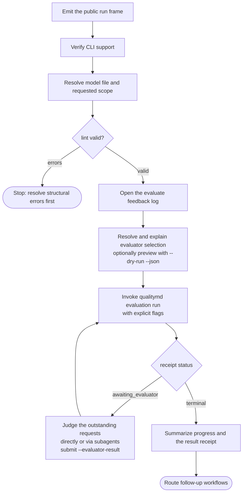

# /quality evaluation workflow

This spec owns the `/quality` skill's shared evaluation contract: how the skill
wraps the CLI-owned deterministic evaluation runner, `qualitymd evaluation run`.
It composes the shared contracts in the parent
[/quality skill](quality-skill.md) spec and is used by the
[`evaluate`](workflows/evaluate.md) workflow.

This document uses BCP 14 keywords only for testable conformance requirements.
The key words "MUST", "MUST NOT", "SHOULD", and "MAY" are to be interpreted as
described in [RFC 2119](../../../docs/reference/rfc2119.md) and
[RFC 8174](../../../docs/reference/rfc8174.md) when, and only when, they appear
in all capitals.

## Background / motivation

Evaluation used to be skill-orchestrated: the skill collected evidence, assigned
ratings, ran a QC loop, and persisted routine payload batches through
`qualitymd evaluation create` and `qualitymd evaluation data set`. That made
evaluation quality depend on the invoking harness, because every harness had to
reconstruct the same workflow from prompt instructions. The CLI now owns the
deterministic work graph and invokes pluggable evaluators for bounded judgment
work units, so the same evaluation runs the same way through Codex, Claude, or a
direct API profile. The skill keeps the agent-mediated user interface around
that engine.

## Operating model

`qualitymd evaluation run` is the evaluation engine. It owns run creation,
resume, the deterministic work graph, evaluator invocation, validation, atomic
persistence into the authoritative `evaluation.json` run artifact, run-local
logs, Markdown report generation, and the final receipt. The evaluation
execution contract — grounding, coverage, verification, roll-up, advice, and the
failure taxonomy — is specified under [`specs/evaluation/`](../../evaluation/index.md)
and [`specs/cli/`](../../cli/index.md), not here.

The `/quality evaluate` workflow is the agent-mediated wrapper around that
engine: it parses intent, frames the run, resolves the model and scope, runs
preflight validation, explains evaluator selection, invokes the runner, and
summarizes the result.

### Wrapper contract

The `/quality evaluate` workflow **MUST** invoke `qualitymd evaluation run`
rather than orchestrating evaluation directly.

The workflow **MUST** continue to provide the agent-mediated user interface:
intent parsing, the run frame, evaluator/default-selection explanation, CLI
invocation, progress summary, result summary, and next-workflow routing.

The workflow **MUST NOT** independently collect evidence, run a parallel QC
loop, second-guess the runner's authoritative evaluation result, orchestrate
the evaluation protocol itself, or write structured evaluation data.

> Rationale: a wrapper that re-evaluates the source recreates the two-engine
> architecture the deterministic runner removes. — 0192

The one sanctioned judgment role is servicing harness checkpoints: when the
run uses the `harness` evaluator, an awaiting receipt carries the runner's
outstanding bounded work requests — up to the run's resolved concurrency.
The skill **MUST** judge each outstanding request within that request's own
bounded boundary and submit one correlated result envelope per request
through `qualitymd evaluation run --resume <run> --evaluator-result`, and
treat the runner's accepted state and terminal receipt as authoritative. It
**MAY** submit results as they become ready — one envelope or several per
resume call — rather than waiting for the whole outstanding set, and it
**MAY** delegate independent requests to native subagents, since each request
is a self-contained evidence boundary. It **MUST NOT** construct its own work
graph, schedule work units, widen source beyond a request's bounded package,
write evaluation records, or adjust accepted results, and it **MUST NOT**
repair invalid output outside the runner's retry loop.

> Rationale: the harness provides judgment, not a second evaluation workflow.
> The outstanding set is the entire boundary for the turn: the runner remains
> the sole scheduler, and how the harness fans requests out is the harness's
> concern. Streaming results back as they land keeps the runner's window
> topped up; batching several into one call trades a little latency for fewer
> resume round trips — either is conformant. — 0194, 0198

Checkpoints carry two request kinds. For a **judgment** request the skill
judges only the supplied bounded evidence. For a **`resolveSource`
resolution** request the skill **MUST** gather the material the request's
selector describes — using its own tools; this is the one checkpoint kind
where gathering is the task — and return it verbatim as the requested
`files` envelope, without assessing, rating, filtering by quality, or
widening beyond what the selector describes. If the material the selector
describes does not exist — including when the selector reads like a
filesystem path that names nothing — the skill **MUST** return a classified
`source_unavailable` failure naming the selector instead of improvising or
substituting evidence.

> Rationale: resolution and judgment stay distinct requests so the gatherer
> and the judge are never the same uncontrolled step; the runner validates,
> caps, hashes, and captures the returned material before any dependent
> judgment. — 0197

The skill **MUST NOT** use `qualitymd evaluation create` or
`qualitymd evaluation data set` for new evaluations. Those commands remain only
for the historical/manual multi-file path.

The workflow still owns the evaluate feedback log under `.quality/logs/` as its
workflow-experience artifact (see
[Evaluate feedback log](workflows/evaluate/feedback-log.md)).

### Conformance to the format spec

Every evaluation **MUST** read the model according to the format spec's
[Model semantics](../../../SPECIFICATION.md#model-semantics) — source
resolution, requirement scope, factor connection, and rating scale semantics.
The runner carries that obligation for evaluation execution; the skill carries
it for the interpretation work it still performs, such as scope resolution and
result explanation. Where a reading of a model and the format spec's model
semantics would diverge, the format spec governs.

## Scope resolution

For scoped `/quality evaluate` requests, natural area and factor labels are the
primary human-facing input. The skill **SHOULD** match labels against required
titles and stable YAML names in the grounded model before invoking the runner.

An unnarrowed `/quality evaluate` **MUST** run a full evaluation: the runner
covers every in-scope modeled area with assessable requirements, including the
`quality-md` area when present. The skill **MUST NOT** narrow the scope beyond
the user's request or make any modeled area opt-in or excluded by default.

> Rationale: full evaluation should mean the resolved model scope. Excluding a
> named area forces evaluators to remember a convention that the model, records,
> and report artifacts cannot express. — 0082

> Rationale: the skill owns human-edge interpretation. Natural labels keep the
> normal evaluation path in project vocabulary while preserving the stable model
> identifiers used by records and reports. — 0061

For `/quality evaluate <label>`, the skill **SHOULD** resolve the label as
follows:

- if it uniquely identifies one area, evaluate that area and its subtree;
- if it uniquely identifies one factor, evaluate that factor in its declaring
  area;
- if it identifies a factor label present in multiple areas, ask
  `What area do you want to evaluate <Factor> for?` as a single-select
  closed-choice intent over the runnable areas (rendered per the shared
  [progressive-enhancement contract](quality-skill.md#user-interaction-contract):
  a native option picker when fit-for-purpose, otherwise the numbered text
  fallback with human-readable titles first, qualified model references as
  secondary context where useful, and an `Answer` line that accepts a number);
- if it matches both area and factor candidates, ask a targeted clarification
  question before running as a single-select closed choice, using the numbered
  text fallback with an `Answer` line when the candidates are enumerable; and
- if it does not resolve, report that the label is not in the model and offer
  nearest runnable scoped-evaluation options visible from the model with an
  explicit response path.

For `/quality evaluate <area-label> <factor-label>`, the skill **SHOULD**
resolve the area label first, then resolve the factor label within that area.

The skill **MUST** continue to accept qualified model references such as
`area:<area-path>` and `factor:<declaring-area-path>::<factor-path>` for exact
addressing. The skill **MUST** resolve a natural-label or unqualified scope to
canonical `area:`/`factor:` references before invoking the runner and pass them
through `--area` and repeatable `--factor`.

Scope **MUST** remain the mechanism by which a user bounds an evaluation's
breadth: full evaluation by default, narrowed by an area or factor reference.
The `/quality evaluate` workflow **MUST NOT** expose or accept an evaluation
rigor selector such as `quick`, `standard`, `deep`, or `--rigor`; execution
strategy is runner-owned configuration, not a user-facing evaluation knob.

> Rationale: the only defensible reason to trade away evaluation coverage was
> cost. The runner's execution strategies make exhaustive coverage practical, so
> scope is the durable way to go faster without pretending partial coverage is
> whole coverage. — 0129

## Evaluator selection

The workflow **MUST** resolve evaluator intent before invoking the runner, in
this precedence:

1. an explicit user evaluator request;
2. a non-`auto` workspace `evaluation.evaluator` configuration;
3. `--evaluator harness`, when the current agent harness can service harness
   checkpoints; and
4. CLI `auto` discovery, only when no harness transport is available.

> Rationale: the skill knows the active harness; the standalone CLI has no
> portable, documented way to infer it. — 0194

The workflow **MUST** explain the selected transport before the first
evaluation mutation and **MUST NOT** silently cross to a different provider
after harness selection or a harness failure; switching evaluators is an
explicit user decision and a new run.

## Workflow

For an `evaluate` invocation the skill's process wraps the runner:

1. **Emit the run frame** as the workflow's first output, per the parent
   contract.
2. **Verify CLI support**, including the evaluation runner surface.
3. **Resolve the model file and requested scope**, using `qualitymd model`
   introspection for canonical references.
4. **Validate** with `qualitymd lint`, stopping on errors (see
   [Driving the CLI](quality-skill.md#driving-the-cli)).
5. **Open the evaluate feedback log** for workflow-experience events.
6. **Resolve and explain evaluator selection** per the
   [selection precedence](#evaluator-selection). It **MAY** preview the
   resolved run with `qualitymd evaluation run --dry-run --json`, and **MAY**
   ask the user to choose an evaluator when the CLI reports a missing or
   ambiguous evaluator.
7. **Invoke the runner** with explicit flags:
   `qualitymd evaluation run [--model <model>] [--area <area-ref>] [--factor <factor-ref>...] [--evaluator <name>] --json`.
8. **Service harness checkpoints.** While the receipt status is
   `awaiting_evaluator`, serve each supplied bounded request — judge a
   judgment request from its bounded evidence only; gather a `resolveSource`
   request's described material and return it verbatim — directly or through
   subagents for independent requests, submit result envelopes (one or
   several per call, as results become ready) with
   `qualitymd evaluation run --resume <run> --evaluator-result - --json`, and
   repeat until a terminal receipt; each resume returns the window topped up
   with newly-ready requests. In unattended automation the loop adds no
   interactive gates: the run advances, returns a report, or stops with the
   runner's classified remedy.
9. **Summarize progress and the result receipt**, then route next workflows
   (review, improve, recommendation follow-up).

## Failure and resume

An `awaiting_evaluator` receipt is expected progress, not a failure: an
interrupted checkpoint loop **MUST** recover by resuming the run without a
result to re-obtain the same outstanding requests, then continue the loop.
Results already judged but not yet submitted may be submitted on a later
resume; requests never submitted stay outstanding at no retry cost.

When a run ends `failed` or `cancelled`, the workflow **MUST** explain the
receipt's stable failure category in user terms and offer
`qualitymd evaluation run --resume <run>` as the recovery path when the run is
resumable.

The workflow **MUST NOT** repair a failed run by hand-authoring run artifacts or
by re-deriving results itself. When the CLI reports a `missing_evaluator` or
similar selection failure, the workflow **SHOULD** present the CLI's remedies —
installing or authenticating an evaluator CLI, configuring an evaluator profile,
or choosing another evaluator — as the next actions.

The workflow **MUST NOT** pass `--resume` together with an `--evaluator` that
differs from the run's recorded evaluator; the runner refuses that conflict, and
the right offer is a new run.

## Result presentation

The workflow **MUST** present the runner's receipt as the authoritative result:
run status, headline rating when present, and the generated `report.md` path. It
**SHOULD** read the generated reports to summarize top findings and
recommendations, and **MUST NOT** restate them with altered ratings, new
findings, or new evidence.

A scoped result **MUST** be presented within its scope, never as a
full-evaluation verdict (see the parent
[boundaries](quality-skill.md#boundaries-and-hard-rules)).
