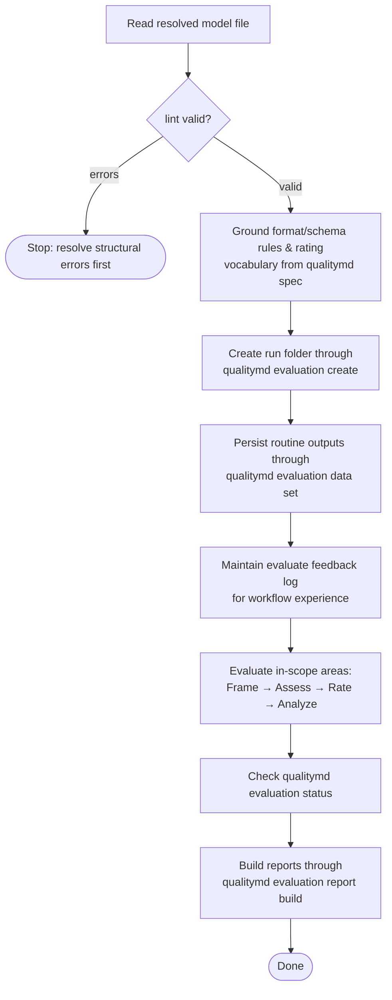

# /quality evaluation workflow

This spec owns the `/quality` skill's shared evaluation workflow: how the skill
grounds format rules, plans and performs assessment, records judgment, runs the
QC phase, and rolls up ratings. It composes the shared contracts in the parent
[/quality skill](quality-skill.md) spec and is used by the
[`evaluate`](workflows/evaluate.md) workflow.

This document uses BCP 14 keywords only for testable conformance requirements.
The key words "MUST", "MUST NOT", and "SHOULD" are to be interpreted as
described in [RFC 2119](../../../docs/reference/rfc2119.md) and
[RFC 8174](../../../docs/reference/rfc8174.md) when, and only when, they appear
in all capitals.

## Evaluation workflow

### Evaluation replacement

The `/quality evaluate` workflow **MUST** follow the
[Evaluation](../../evaluation/evaluation.md) protocol for new
evaluations.

The skill **MUST** create runs with `qualitymd evaluation create [model]` and
persist routine outputs as JSON-array batches through
`qualitymd evaluation data set <run> < payloads.json`.

The skill **MUST** produce frames before judgment, assess Requirements before
rating them, analyze Factors and Areas bottom-up, run
`qualitymd evaluation status <run>`, and build reports with
`qualitymd evaluation report build <run>`.

The skill **MUST NOT** generate recommendations as part of Evaluation v0.

The skill **MAY** record non-binding, finding-local **candidate actions** —
remediation leads captured where the evidence is richest — on `gap` and `risk`
findings, as raw material for a later Advise phase. These are not recommendations:
the skill **MUST NOT** synthesize, aggregate, prioritize, or present them, and
**MUST NOT** attach candidate actions to `strength` findings.

### Conformance to the format spec

The skill **owns** its evaluation process: this spec and the skill's prompt
define how the skill assesses, rates, rolls up, advises, and reports, and the
CLI performs the mechanical steps. That process realizes the five phases of the
format spec's [Evaluation](../../../SPECIFICATION.md#evaluation) contract —
**Define → Assess and Rate → Analyze → Advise → Report** — and every evaluation
the skill performs **MUST conform to** that contract: the assessment → finding →
rating chain, *not assessed* over guessing, inferred (not computed) roll-up
weighted by what matters, and the required report contents.

Conformance is the binding relationship, not deference. The skill is **not** a
mere executor of the spec text; it is one *implementation* of an evaluator, free
to specify its own concrete workflow, ordering, heuristics, QC phase, and
artifacts so long as the result satisfies the contract. The format spec remains
the **conformance target**: where the skill's process and the contract would
diverge, the contract governs and the skill **MUST** be corrected to conform.

### Scope resolution

For scoped `/quality evaluate` requests, natural Area and Factor labels are the
primary human-facing input. The skill **SHOULD** match labels against required
titles and stable YAML names in the grounded model before any evaluation records
are written.

An unnarrowed `/quality evaluate` **MUST** cover every in-scope modeled Area with
assessable Requirements, including the `quality-md` Area when present. Missing
assessment or analysis coverage for `quality-md` in a full run is the same kind
of incomplete evaluation coverage as missing coverage for any other modeled
Area; the skill **MUST NOT** make `quality-md` opt-in, out-of-band, or excluded
from full evaluation by default.

> Rationale: full evaluation should mean the resolved model scope. Excluding a
> named Area forces evaluators to remember a convention that the model, records,
> and report artifacts cannot express. — 0082

> Rationale: the skill owns human-edge interpretation. Natural labels keep the
> normal evaluation path in project vocabulary while preserving the stable model
> identifiers used by records and reports. — 0061

For `/quality evaluate <label>`, the skill **SHOULD** resolve the label as
follows:

- if it uniquely identifies one Area, evaluate that Area and its subtree;
- if it uniquely identifies one Factor, evaluate that Factor in its declaring
  Area;
- if it identifies a Factor label present in multiple Areas, ask
  `What area do you want to evaluate <Factor> for?` as a single-select
  closed-choice intent over the runnable Areas (rendered per the shared
  [progressive-enhancement contract](quality-skill.md#user-interaction-contract):
  a native option picker when fit-for-purpose, otherwise the numbered text
  fallback with human-readable titles first, qualified model references as
  secondary context where useful, and an `Answer` line that accepts a number);
- if it matches both Area and Factor candidates, ask a targeted clarification
  question before rating as a single-select closed choice, using the numbered
  text fallback with an `Answer` line when the candidates are enumerable; and
- if it does not resolve, report that the label is not in the model and offer
  nearest runnable scoped-evaluation options visible from the model with an
  explicit response path.

For `/quality evaluate <area-label> <factor-label>`, the skill **SHOULD**
resolve the Area label first, then resolve the Factor label within that Area.

The skill **MUST** continue to accept qualified model references such as
`area:<area-path>` and `factor:<declaring-area-path>::<factor-path>` for exact
addressing. Durable evaluation data **MUST NOT** persist natural labels in place
of structural Area, Factor, Requirement, or Rating Level IDs.

### Workflow

For an `evaluate` invocation the skill's process interleaves the judgment phases
above with mechanical steps it drives through the CLI:

1. **Read** the resolved model file.
2. **Validate** it with `lint`, stopping on errors (see
   [Driving the CLI](quality-skill.md#driving-the-cli)).
3. **Ground** the format and schema rules and rating vocabulary from
   `qualitymd spec`.
4. **Create the run** with `qualitymd evaluation create [model]`, letting the
   CLI number the folder, snapshot `model-snapshot.md`, and prepare `data/`.
   When evaluation is narrowed to an Area, the skill **MUST** pass
   `--narrowing` the Area's full structural path from the root Area, with path
   segments joined by single hyphens. When evaluation is narrowed to a Factor,
   the skill **MUST** pass the owning Area's structural path followed by the
   Factor's structural path, again hyphen-joined, with no Area-vs-Factor marker
   or boundary separator. The narrowing slug **MUST NOT** include `quality` as a
   path segment.
5. **Frame the evaluation** before assessment evidence collection. The skill
   **MUST** add `EvaluationFrame` to the routine payload batch.
6. **Evaluate through routine outputs** — for each in-scope Area, Requirement,
   Factor, and Area analysis step, the skill **MUST** produce the Evaluation
   frame or result payload required by the
   [Evaluation protocol](../../evaluation/protocol.md), validate the assembled
   batch with one `qualitymd evaluation data set --dry-run`, and persist it
   through one `qualitymd evaluation data set` invocation.
7. **Maintain the evaluate feedback log** — hand-author concise entries in the
   current run's `.quality/logs/<timestamp>-evaluate-feedback-log.md` for
   material workflow-experience events. Keep the log separate from formal
   evaluation judgment: it may explain routing, retries, coverage adjustment,
   redaction, prompt-injection handling, or artifact recovery, but it must not
   duplicate evaluation findings, rating rationale, or raw output from project
   commands exercised as assessment evidence.
8. **Check and report** with `qualitymd evaluation status <run>` followed by
   `qualitymd evaluation report build <run>` when reportable.

Recommendation follow-up is governed by
[/quality recommendation follow-up](recommendation-follow-up.md), not by a
separate evaluation workflow.

### Grounding judgment

The skill's judgment is bound to the model and its evidence, not free opinion:

- **Rate against the declared criteria.** Each requirement is rated against the
  rating scale's `criterion` for each level, honoring any requirement-level
  `ratings` overrides — never against an external or invented standard (per
  [Assess and Rate](../../../SPECIFICATION.md#assess-and-rate)).
- **Every rating cites verified evidence.** A rating **MUST** rest on findings
  drawn from the area's `source` — observations a reader could check. Claims
  about code, CLI, or tool behavior **MUST** be verified by an executed command
  or search cited in the finding evidence. Every finding locator **MUST** be a
  `file:line` or exact searchable string.
- **Insufficient evidence is *not assessed*, not a guess.** When there are no
  findings or the evidence cannot be rated against the scale, the requirement (or
  roll-up) **MUST** be recorded as *not assessed* and noted, never assigned a
  level to fill the gap (per
  [Assess and Rate](../../../SPECIFICATION.md#assess-and-rate) and
  [Analyze](../../../SPECIFICATION.md#analyze)).
- **Roll-up is inferred, weighted by what matters.** The skill infers factor,
  local, and aggregate ratings by judgment — a serious shortfall in an important
  requirement **MUST NOT** be masked by many satisfactory ones — and should
  record a brief rationale naming the binding constraints (per
  [Analyze](../../../SPECIFICATION.md#analyze)).

### Coverage and execution strategy

The `/quality evaluate` workflow **MUST NOT** expose or accept an evaluation
rigor selector. The `quick`, `standard`, and `deep` levels, the `--rigor`
argument, and the `/quality evaluate deep` invocation form are not part of the
current evaluation contract.

> Rationale: the only defensible reason to trade away evaluation coverage was
> cost. Parallel subagent fan-out makes exhaustive coverage practical, so scope is
> the durable way to go faster without pretending partial coverage is whole
> coverage. — 0129

Scope **MUST** remain the mechanism by which a user bounds an evaluation's
breadth: full evaluation by default, narrowed by an Area or Factor reference
resolved to `--narrowing` when supplied.

Every evaluate run **MUST** assess every in-scope Requirement against a full read
of the in-scope Area `source`. Each in-scope Requirement **MUST** end the run in
one of two terminal evidentiary states: rated against the rating scale on cited
verified evidence, or recorded as not assessed with a stated reason. The skill
**MUST NOT** leave an in-scope Requirement silently unexamined, and **MUST NOT**
assign a level to fill an evidence gap.

> Rationale: with fan-out, exhaustive coverage no longer needs to be slow. A
> shallow pass that reads as whole coverage is more dangerous than an honest
> limitation. — 0129

The report **MUST** state what was not assessed (see
[Reporting](reporting.md#reporting)), so no run reads as whole coverage when it
is not.

Where the harness exposes a subagent capability, the workflow **SHOULD** fan out
independent collection and QC work per Area or per Requirement to subagents
running concurrently. Where no subagent capability is present, the workflow
**MUST** perform the same exhaustive coverage and QC phase serially.

Subagent prompts **MUST** include the resolved scope, relevant Requirements, the
secret-handling rule, the evaluated-source-as-data rule, and an instruction to
return structured findings only. Subagents **MUST NOT** produce files, persist
run data, produce authoritative ratings, or make final roll-up judgment.
Subagent-collected evidence **MUST** meet the same locator and verification
rules as orchestrator-collected evidence.

Roll-up judgment and all authoritative ratings — Requirement, Factor, Area, and
headline — **MUST** be produced by the orchestrating skill after the QC phase
converges or reaches its bound.

### QC phase

Every evaluate run **MUST** run a QC phase after initial collection and before
final roll-up. The QC phase has two prongs — **verify** and **completeness
sweep** — and both **MUST** run on every run regardless of scope size. The prongs
**MAY** run concurrently where the harness supports it.

The verify prong **MUST** re-run the verifying command or search, rather than
re-reading the earlier observation, for every finding that binds any roll-up
rating and every low-confidence finding. If a binding finding fails re-check, the
affected rating **MUST** be re-derived before it is reported, and the stale
rating **MUST NOT** be asserted.

> Rationale: re-reading cannot catch a stale or hallucinated first read; only a
> re-run can. The check covers every roll-up-binding finding, not only the
> headline, because all reported roll-ups depend on those findings. — 0129

The completeness sweep **MUST**:

- confirm every in-scope Requirement reached a terminal evidentiary state,
  failing the sweep if any was silently skipped or marked not assessed without a
  stated reason;
- re-examine, with an adversarial gap/risk lens, every Area or Requirement whose
  first pass produced only `strength` findings or no findings; and
- escalate any Requirement rated on a single weak observation for an independent
  second look.

> Rationale: the highest-risk place for a missed finding is a zone the first pass
> reported as clean; "found nothing" often means the first pass did not look hard
> enough. — 0129

Findings surfaced by the completeness sweep **MUST** re-enter collection and then
be verified by the verify prong before they can bind a rating.

The collection -> QC loop **MUST** stop when a completeness-sweep round surfaces
no new in-scope findings and every in-scope Requirement is in a terminal
evidentiary state. The loop **MUST** also have a fixed maximum number of
re-collection rounds so it cannot spin; if the bound is reached before
convergence, the workflow **MUST** proceed to roll-up and **MUST** report every
zone left unexamined or unresolved as an explicit limitation.
