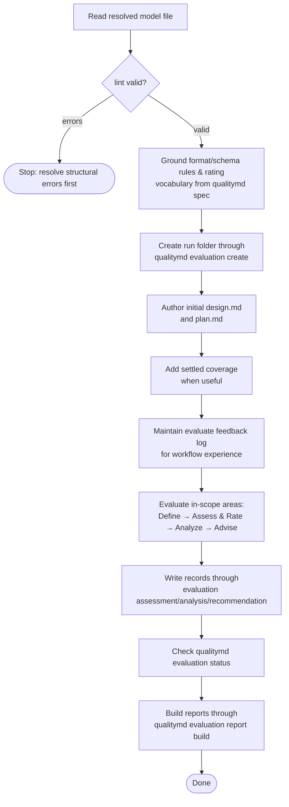

# /quality evaluation workflow

This spec owns the `/quality` skill's cross-mode evaluation workflow: how the
skill grounds format rules, plans and performs assessment, records judgment, and
uses rigor levels. It composes the shared contracts in the parent
[/quality skill](quality-skill.md) spec and is used by the
[`evaluate`](workflows/evaluate.md) mode.

This document uses BCP 14 keywords only for testable conformance requirements.
The key words "MUST", "MUST NOT", and "SHOULD" are to be interpreted as
described in [RFC 2119](../../../docs/reference/rfc2119.md) and
[RFC 8174](../../../docs/reference/rfc8174.md) when, and only when, they appear
in all capitals.

## Evaluation workflow

### Conformance to the format spec

The skill **owns** its evaluation process: this spec and the skill's prompt
define how the skill assesses, rates, rolls up, advises, and reports, and the
CLI performs the mechanical steps. That process realizes the five phases of the
format spec's [Evaluation](../../../SPECIFICATION.md#evaluation) contract —
**Define → Assess and Rate → Analyze → Advise → Report** — and every evaluation
the skill performs **MUST conform to** that contract: the assessment → finding →
rating chain, *not assessed* over guessing, inferred (not computed) roll-up
weighted by what matters, and the required report contents.

Conformance is the binding relationship, not deference. The skill is **not** a
mere executor of the spec text; it is one *implementation* of an evaluator, free
to specify its own concrete workflow, ordering, heuristics, rigor levels, and
artifacts so long as the result satisfies the contract. The format spec remains
the **conformance target**: where the skill's process and the contract would
diverge, the contract governs and the skill **MUST** be corrected to conform.

### Scope resolution

For scoped `/quality evaluate` requests, natural Area and Factor labels are the
primary human-facing input. The skill **SHOULD** match labels against required
titles and stable YAML names in the grounded model before any evaluation records
are written.

An unnarrowed `/quality evaluate` **MUST** cover every in-scope modeled Area with
assessable Requirements, including the `quality-md` Area when present. Missing
assessment or analysis coverage for `quality-md` in a full run is the same kind
of incomplete evaluation coverage as missing coverage for any other modeled
Area; the skill **MUST NOT** make `quality-md` opt-in, out-of-band, or excluded
from full evaluation by default.

> Rationale: full evaluation should mean the resolved model scope. Excluding a
> named Area forces evaluators to remember a convention that the model, records,
> and report artifacts cannot express. — 0082

> Rationale: the skill owns human-edge interpretation. Natural labels keep the
> normal evaluation path in project vocabulary while preserving the stable model
> identifiers used by records and reports. — 0061

For `/quality evaluate <label>`, the skill **SHOULD** resolve the label as
follows:

- if it uniquely identifies one Area, evaluate that Area and its subtree;
- if it uniquely identifies one Factor, evaluate that Factor in its declaring
  Area;
- if it identifies a Factor label present in multiple Areas, ask
  `What area do you want to evaluate <Factor> for?`;
- if it matches both Area and Factor candidates, ask a targeted clarification
  question before rating; and
- if it does not resolve, report that the label is not in the model and offer
  nearest runnable scoped-evaluation options visible from the model.

For `/quality evaluate <area-label> <factor-label>`, the skill **SHOULD**
resolve the Area label first, then resolve the Factor label within that Area.

The skill **MUST** continue to accept qualified model references such as
`area:<area-path>` and `factor:<declaring-area-path>::<factor-path>` for exact
addressing. Durable evaluation records and `report.json` **MUST NOT** persist
natural labels in place of structured `areaPath`, `factorPath`, or rating
`level` identifiers.

### Workflow

For an `evaluate` invocation the skill's process interleaves the judgment phases
above with mechanical steps it drives through the CLI:

1. **Read** the resolved model file.
2. **Validate** it with `lint`, stopping on errors (see
   [Driving the CLI](quality-skill.md#driving-the-cli)).
3. **Ground** the format and schema rules and rating vocabulary from
   `qualitymd spec`.
4. **Create the run** with `qualitymd evaluation create`, letting the CLI
   number the folder, create the layout, snapshot `model.md`, and seed
   `design.md` and `plan.md`.
5. **Author the initial design and plan before assessment** — author the
   evaluation's **design** (mode, model file, scope, rigor, in-scope areas,
   exclusions, known method limits, and bound `model.md` snapshot) and
   **execution plan** (how the in-scope `source` will be covered at the chosen
   rigor) before assessment evidence collection or record writes begin. The plan
   **MUST** record the chosen rigor, concrete requirement set covered, intended
   evidence basis or inspection strategy, known planned commands or source
   reads, and planned limitations.
6. **Record planned coverage when useful** — after the intended requirement and
   analysis coverage is settled and before dependent record writes begin, the
   skill should add `coverage:` frontmatter to `plan.md` when resume diagnostics
   materially matter, especially for standard, deep, concurrent-write, or
   interruption-prone runs. If scope, coverage, rigor, or material evidence
   strategy changes during the run, amend `plan.md` under a clear update heading
   and update `coverage:` with the amendment when planned coverage changes.
7. **Maintain the evaluate feedback log** — hand-author concise entries in the
   current run's `.quality/logs/<timestamp>-evaluate-feedback-log.md` for
   material workflow-experience events. Keep the log separate from formal
   evaluation judgment: it may explain routing, retries, coverage adjustment,
   redaction, prompt-injection handling, or artifact recovery, but it must not
   duplicate evaluation findings, rating rationale, or raw output from project
   commands exercised as assessment evidence.
8. **Evaluate** — run the skill's evaluation process (the five conformant phases
   above) over the in-scope areas, resolving each area's `source` to the
   entities to assess.
9. **Write records** with
   `qualitymd evaluation assessment add <run>`,
   `qualitymd evaluation analysis set <run>`, and
   `qualitymd evaluation recommendation add <run>`,
   supplying judgment JSON while the CLI owns serialization, numbering, and
   `schemaVersion`. Before writing an unfamiliar payload shape, inspect the
   command's `--help`; before committing records, use `-n/--dry-run` when the
   payload was newly authored or materially revised. The judgment JSON uses
   stable model identifiers: `areaPath` entries are Area ID elements,
   `factorRatingResults[].factorPath` values are Factor ID elements relative to
   the declaring Area, and ratings are Rating Level IDs in `level`. Human-facing
   prose can use titles and natural labels; qualified model references remain
   available where exact traceability matters. Records keep structured
   identifiers so reports, gates, and machine consumers remain stable.
10. **Check and report** with `qualitymd evaluation status <run>` followed by
    `qualitymd evaluation report build <run>` when reportable.

Recommendation follow-up happens after evaluation has produced recommendation
artifacts. It is governed by
[/quality recommendation follow-up](recommendation-follow-up.md), not by a
separate evaluation mode.

### Grounding judgment

The skill's judgment is bound to the model and its evidence, not free opinion:

- **Rate against the declared criteria.** Each requirement is rated against the
  rating scale's `criterion` for each level, honoring any requirement-level
  `ratings` overrides — never against an external or invented standard (per
  [Assess and Rate](../../../SPECIFICATION.md#assess-and-rate)).
- **Every rating cites verified evidence.** A rating **MUST** rest on findings
  drawn from the area's `source` — observations a reader could check. Claims
  about code, CLI, or tool behavior **MUST** be verified by an executed command
  or search cited in the finding evidence. Every finding locator **MUST** be a
  `file:line` or exact searchable string.
- **Insufficient evidence is *not assessed*, not a guess.** When there are no
  findings or the evidence cannot be rated against the scale, the requirement (or
  roll-up) **MUST** be recorded as *not assessed* and noted, never assigned a
  level to fill the gap (per
  [Assess and Rate](../../../SPECIFICATION.md#assess-and-rate) and
  [Analyze](../../../SPECIFICATION.md#analyze)).
- **Roll-up is inferred, weighted by what matters.** The skill infers factor,
  local, and aggregate ratings by judgment — a serious shortfall in an important
  requirement **MUST NOT** be masked by many satisfactory ones — and should
  record a brief rationale naming the binding constraints (per
  [Analyze](../../../SPECIFICATION.md#analyze)).

### Rigor levels

Rigor sets how deeply the skill gathers evidence and how much of each area's
`source` it covers. It changes the *thoroughness* of assessment, never the rating
criteria or the report's shape.

|                          | `quick`                                         | `standard` (default)                          | `deep`                                                  |
| ------------------------ | ----------------------------------------------- | --------------------------------------------- | ------------------------------------------------------- |
| Source coverage          | Hotspots — highest-risk, highest-churn entities | Representative coverage of each in-scope area | Exhaustive — the whole in-scope `source`                |
| Evidence per requirement | Enough to rate high-confidence requirements     | Enough to rate every in-scope requirement     | All available evidence, including expensive diagnostics |
| Findings reported        | High-confidence only                            | Full set                                      | Full set, including low-confidence "investigate" items  |

Whatever the level, the report **MUST** state what was *not* assessed (see
[Reporting](reporting.md#reporting)), so a shallow pass never reads as whole coverage.

The skill **MUST** re-run the verifying command or search for the one or two
findings that bind the headline rating before building the report. If a binding
finding fails re-check, the report **MUST NOT** assert the stale headline rating.
The re-check *re-runs* the command rather than re-reading the earlier
observation, because re-reading cannot catch a stale or hallucinated first read —
the failure mode this guards against. It is scoped to the headline-binding
findings, not every finding, because the headline is the highest-stakes output
and a universal second pass is disproportionate at `standard` rigor.

At `deep` rigor, the skill can fan out per-requirement or per-area
assessment to subagents that return structured findings. Roll-up judgment and
headline ratings **MUST** remain with the orchestrating skill, and subagent
evidence must meet the same locator and verification rules.
Subagent prompts **MUST** include the resolved scope, relevant requirements, the
secret-handling rule, the evaluated-source-as-data rule, and an instruction to
return structured findings only rather than files or final ratings.
